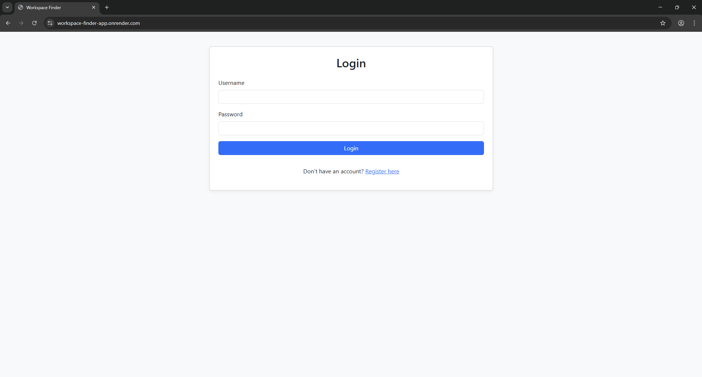
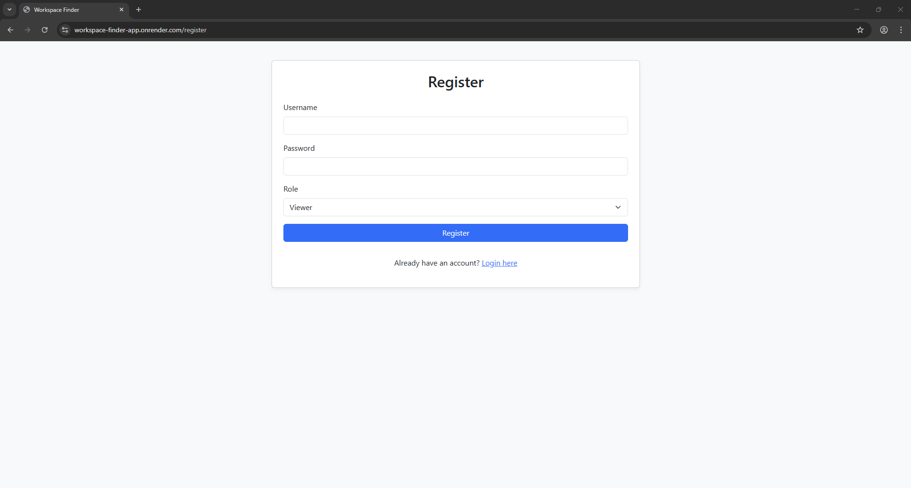
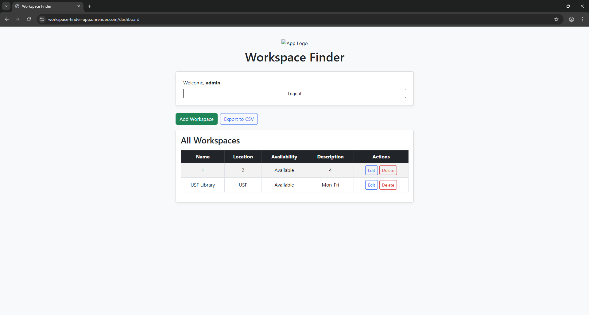
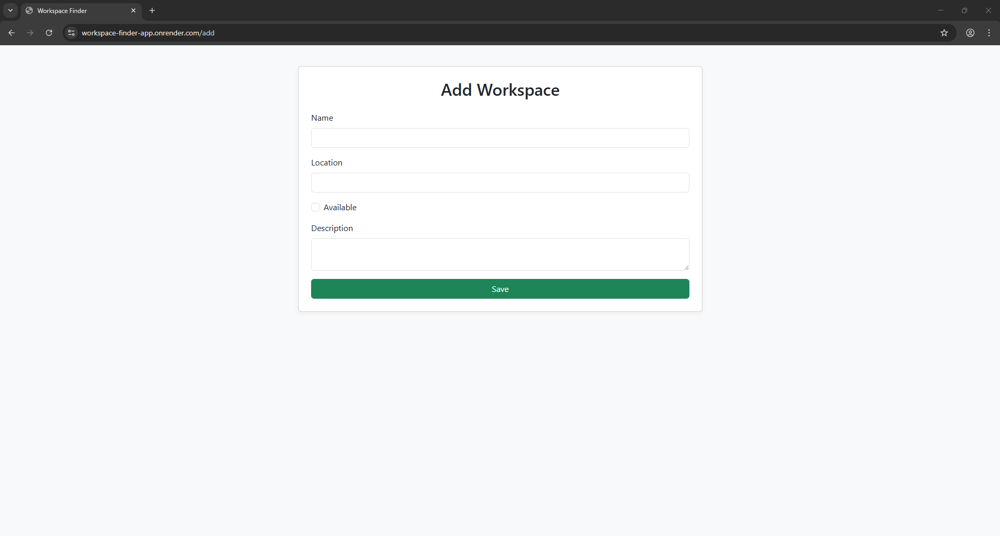
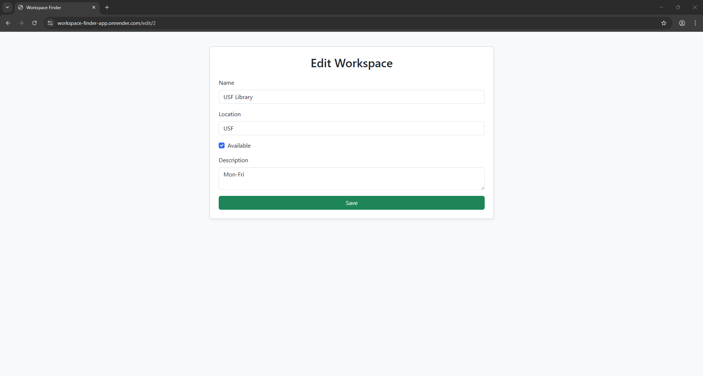
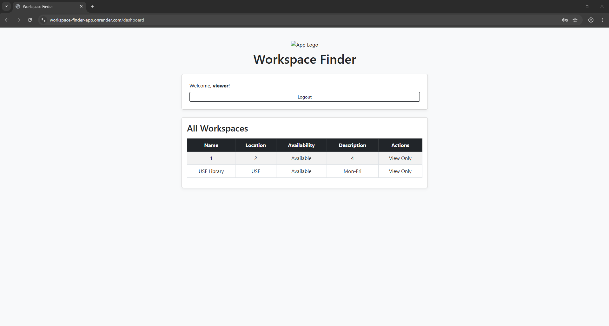

# 🧠 Workspace Finder App

A role-based Flask web application that allows users to manage shared workspaces. Supports user registration, admin/viewer roles, workspace CRUD, CSV export, and modern Bootstrap styling.

[](https://workspace-finder-app.onrender.com)
[](https://github.com/asif-imtiaz-j/workspace-finder-app)

---

## 🚀 Live Demo

👉 [workspace-finder-app.onrender.com](https://workspace-finder-app.onrender.com)

> ⚠️ Note: May take 30–60 seconds to load due to Render's free-tier cold start.

---

## 📸 Screenshots

| Login | Register | Dashboard (Admin) |
|-------|----------|-------------------|
|  |  |  |

| Add Workspace | Edit Workspace | Dashboard (Viewer) |
|---------------|----------------|---------------------|
|  |  |  |

---

## 🔑 Features

- 👤 User Registration & Login
- 🔐 Admin / Viewer role-based access
- 📝 Workspace CRUD (Create, Read, Update, Delete)
- 📤 Export workspace data as CSV
- ✅ Bootstrap 5 UI with Font Awesome icons
- 🌐 Deployed on Render (Free Tier)

---

## 🧪 Tech Stack

- Python 3.11
- Flask (Login, WTF, SQLAlchemy)
- SQLite (lightweight database)
- Gunicorn (for deployment)
- Bootstrap 5
- Render (free deployment)

---

## 🛠️ Local Setup

```bash
# Clone repo
git clone https://github.com/asif-imtiaz-j/workspace-finder-app.git
cd workspace-finder-app

# Set up virtual environment
python -m venv venv
.\venv\Scripts\activate

# Install dependencies
pip install -r requirements.txt

# Run the app
python run.py
